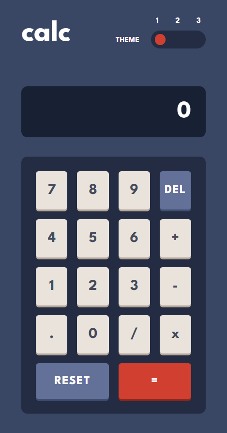

# Frontend Mentor - Calculator App Solution

This is a solution to the [Calculator App challenge on Frontend Mentor](https://www.frontendmentor.io/challenges/calculator-app-9lteq5N29). Frontend Mentor challenges help you improve your coding skills by building realistic projects.

## Table of contents

- [Overview](#overview)
  - [The challenge](#the-challenge)
  - [Screenshot](#screenshot)
  - [Links](#links)
- [My process](#my-process)
  - [Built with](#built-with)
  - [What I learned](#what-i-learned)
  - [Continued development](#continued-development)
  - [Useful resources](#useful-resources)
- [Author](#author)

## Overview

### The challenge

Users should be able to:

- See the size of the elements adjust based on their device's screen size
- Perform mathematical operations like addition, subtraction, multiplication, and division
- Adjust the color theme based on their preference
- **Bonus**: Have their initial theme preference checked using `prefers-color-scheme` and have any additional changes saved in the browser

### Screenshot

### Links

- Solution URL: [Github](https://github.com/atharvpote/Calculator-App)
- Live Site URL: [calc](https://calc-fm.netlify.app/)

## My process

### Built with

- Semantic HTML5 markup
- CSS custom properties
- Flexbox
- CSS Grid
- Mobile-first workflow
- [React](https://reactjs.org/) - JS library
- [Styled Components](https://styled-components.com/) - CSS in JS library
- [Polished](https://styled-components.com/) - Toolset for writing styles in JS

### What I learned

This was a super fun project. I learned a lot about state management especially how using reducer and context together makes life so much easier. This project made me think about lot the edge cases that we normally don't take into consideration but makes a big impact. I also understood why arranging our code in good is so important as when the files gets tool long you just jump back and forth in the same file. I also like how easy it is to apply themes with styled components, it's awesome.

### Continued development

I'm looking forward to use the reducer and context API in the future project as they make state management much easier, I'll also be using styled components theme provider as it makes add new themes so much easier. I'm also looking forward to use localStorage API more often.

### Useful resources

### Useful resources

- [Toggle Switch Example](https://codepen.io/mburnette/pen/LxNxNg)
- [React Docs](https://reactjs.org/docs/getting-started.html)
- [Styled Components Docs](https://styled-components.com/docs)
- [Polished Docs](https://polished.js.org/docs/)
- [MDN](https://developer.mozilla.org/en-US/)
- [Parcel Docs](https://parceljs.org/docs/)
- [ESLint Docs](https://eslint.org/docs/latest/)
- [Stylelint Docs](https://stylelint.io/)

## Author

- GitHub - [Atharv Pote](https://github.com/atharvpote)
- Frontend Mentor - [@atharvpote](https://www.frontendmentor.io/profile/atharvpote)
